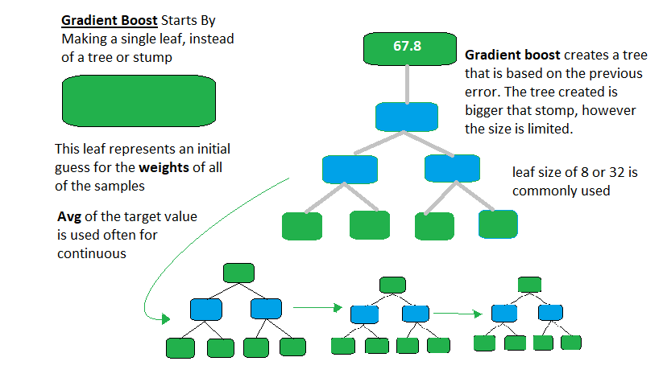

# Gradient Boost Regressor
## Brief description for Ensemble, Bagging and Boosting
When we try to predict the target variable using any machine learning technique, the main causes of difference in actual and predicted values are noise, variance, and bias. Ensemble helps to reduce these factors (except noise, which is irreducible error)
An ensemble is just a collection of predictors which come together (e.g. mean of all predictions) to give a final prediction. 

The reason we use ensembles is that many different predictors trying to predict same target variable will perform a better job than any single predictor alone. Ensembling techniques are further classified into Bagging and Boosting. Example of bagging ensemble is Random Forest models.
### Bagging
Bagging is a simple ensembling technique in which we build many independent predictors/models/learners and combine them using some model averaging techniques. (e.g. weighted average, majority vote or normal average)
### Boosting
Boosting is an ensemble technique in which the predictors are not made independently, but sequentially. This technique employs the logic in which the subsequent predictors learn from the mistakes of the previous predictors. The predictors can be chosen from a range of models like decision trees, regressors, classifiers etc. Because new predictors are learning from mistakes committed by previous predictors, it takes less time/iterations to reach close to actual predictions. Gradient Boosting is an example of boosting algorithm.


<table>
    <tr>
        <th>Height (m)</th>
        <th>Fev. Color</th>
        <th>Gender</th>
        <th>Weight</th>
    </tr>
    <tr>
    	<td>1.6</td>
    	<td>Blue</td>
    	<td>Female</td>
    	<td>76</td>
    </tr>
    <tr>
    	<td>1.5</td>
    	<td>Blue</td>
    	<td>Female</td>
    	<td>56</td>
    </tr>
    <tr>
    	<td>1.8</td>
    	<td>Red</td>
    	<td>Male</td>
    	<td>73</td>
    </tr>
    <tr>
    	<td>1.5</td>
    	<td>Green</td>
    	<td>Male</td>
    	<td>77</td>
    </tr>
    <tr>
    	<td>1.4</td>
    	<td>Blue</td>
    	<td>Female</td>
    	<td>57</td>
    </tr>
</table>



## Baye’s Theorem
 describes the probability of an event, based on prior knowledge of conditions that might be related to the event. For example, if the probability that someone has cancer is related to their age.


where A and B are events and  P(A)$\neq$0 and P(B)$\neq$0

In our case: P(class|data) = (P(data|class) * P(class)) / P(data)

### Example
Given an array of  x = ( 5, 1, 4, 2, 8 )
#### First Pass
- ( **5**, **1**, 4, 2, 8, ) –> ( **1**, **5**, 4, 2, 8 ), Here, algorithm compares the first two elements, and swaps since 5 > 1.
- ( 1, **5**, **4**, 2, 8 ) –>  ( 1, **4**, **5**, 2, 8 ), Swap since 5 > 4
- ( 1, 4, **5**, **2**, 8 ) –>  ( 1, 4, **2**, **5**, 8 ), Swap since 5 > 2
- ( 1, 4, 2, **5**, **8** ) –> ( 1, 4, 2, **5**, **8** ), Now, since these elements are already in order (8 > 5), algorithm does not swap them

#### Second Pass:
- ( **1**, **4**, 2, 5, 8 ) –> ( **1**, **4**, 2, 5, 8 )
- ( 1, **4**, **2**, 5, 8 ) –> ( 1, **2**, **4**, 5, 8 ), Swap since 4 > 2
- ( 1, 2, **4**, **5**, 8 ) –> ( 1, 2, **4**, **5**, 8 )
- ( 1, 2, 4, **5**, **8** ) –>  ( 1, 2, 4, **5**, **8** )

Now, the array is already sorted, but our algorithm does not know if it is completed. The algorithm needs one whole pass without any swap to know it is sorted. Thus the algorithm will go on to the third pass

## Python Code Sample

```sh
def bubble_sort(num_list):
	n = len(num_list)
	# Traverse through all array elements
	for i in range(n):
		# The last elements are already in place
		for j in range(0, n-i-1):
			# Traverse the array from 0 to n-i-1
			# Swap if the element is found greater than the 
			# next element
			if num_list[j] > num_list[j+1]:
				num_list[j], num_list[j+1] = num_list[j+1], num_list[j]
	return num_list
```

Java Code is also provided.

License
----

None

